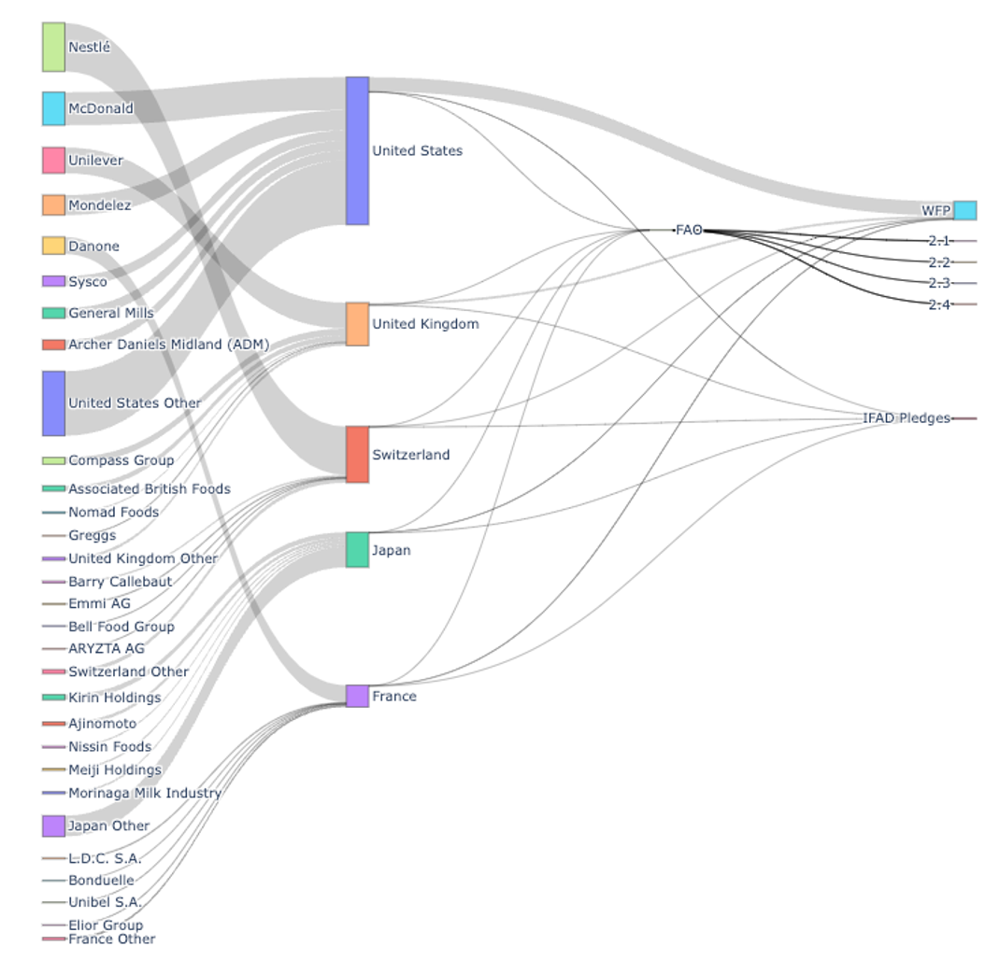
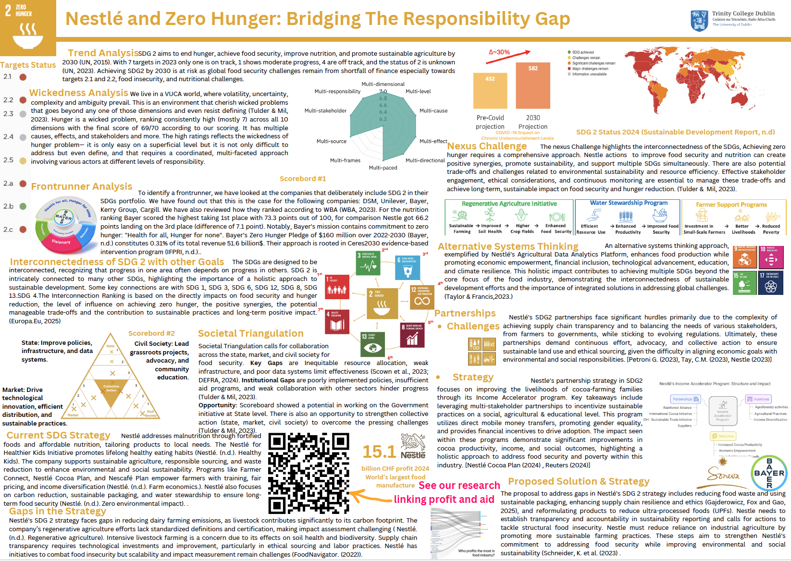

#### Linking Profits to Aid - Exploratory Visualization

We attempted to map the link between profits of companies and funds that goes to main organisations fighting hunger WFP, FAO, IFAD.

Assumptions and oversimplifications:
MNCs such as Nestle pays taxes in many different countries, e.g. Nestle pays 3,5 billion (2023) francs to Switzerland while total taxes paid are 13,1 billion franc (https://www.nestle.com/sustainability/responsible-business/tax-management-strategy).

There are multiple organisations that try to alleviate hunger WFP, FAO, and IFAD are just prominent examples but do not represent the entirety of the scene. Also countries pay at the EU level to some organisations which is not accounted for. Initial idea was to measure how quantified aid towards Zero Hunger is in comparison to the profits of the leading companies in the food industry.

Study has limitations, but shows potential for an in-depth analysis. 

**Data Sources:**
- top-food-companies-by-earnings.csv: https://companiesmarketcap.com/food/most-profitable-food-companies/
- wfp-2024.csv: https://www.wfp.org/funding/2024
- ifad_pledges: https://www.ifad.org/documents/38711624/40240493/ifad12_pledges.jpg/1af527eb-d24f-8bcc-f991-77ab5f5dde0e?t=1620201533354?t=1619618656240
- fao: https://www.fao.org/transparency/projects
- nestle_supplying_countries.csv: https://www.nestle.com/sustainability/sustainable-sourcing/supply-chain-disclosure
- 2024-global-hunger-index-short.csv: https://www.globalhungerindex.org/download/all.html

This work was prepared as a part of submission to Sustainable International Business Global Poster Competition 2025 organised by the Academy of International Business United
Kingdom & Ireland Chapter (AIB UKI).

**References:**
Approaches behind 124 billion servings of affordable nutrition. https://www.nestle.com/stories/nestle-action-affordable-nutrition-malnutrition-hunger (2022).
Bayer. (n.d.). Zero Hunger Pledge. Retrieved from https://www.bayer.com/en/agriculture/zero-hunger-pledge
Better farming for a better future | Nestlé Global. https://www.nestle.com/stories/sustainable-cocoa-farming-better-future (2021).
Community giving | Nestlé Global. https://www.nestle.com/sustainability/people-communities/community-giving.
Contributing to global sustainability goals | Nestlé Global. https://www.nestle.com/sustainability/regenerative-food-systems/global-goals.
Creative, V. Who else can help with lowering global food insecurity rates? Vox https://www.vox.com/ad/384073/who-else-can-help-with-lowering-global-food-insecurity-rates (2024).
Department for Environment, Food & Rural Affairs (2024) 'United Kingdom Food Security Report 2024: Theme 3: Food Supply Chain Resilience'. Available at: https://www.gov.uk/government/statistics/united-kingdom-foodsecurity-
report-2024/united-kingdom-food-security-report-2024-theme-3-food-supply-chain-resilience.
Discover our business strategy | Nestlé Global. https://www.nestle.com/about/strategy.
Early, C. & Early, C. More collaboration needed as cocoa firms battle deforestation and child labour risks. Reuters (2024).
FoodNavigator. (2022). Nestlé highlights key challenge of food insecurity as it hikes prices 6.5%. Retrieved from Animal Outlook. (2022). Nestlé’s nightmare: Undercover investigation reveals cruelty in dairy supply chain.
Retrieved from https://animaloutlook.org/investigations/nestles-nightmare/
Gajderowicz, B., Fox, M.S. and Gao, Y. (2025) 'Towards an Ontology of Traceable Impact Management in the Food Supply Chain', arXiv preprint arXiv:2501.05486. Available at: https://arxiv.org/abs/2501.05486
Global Agriculture and Food Security Program (GAFSP). (n.d.). Our mission. Retrieved from https://www.gafspfund.org/index.php/our-mission
Global hunger levels to stay high for another 136 years - new Global Hunger Index reveals. Concern Worldwide https://www.concern.net/press-releases/global-hunger-levels-stay-high-another-136-years-new-global-hungerindex-
reveals (2024).
GRRR.nl. Food and Agriculture Benchmark | WBA. World Benchmarking Alliance https://www.worldbenchmarkingalliance.org/publication/food-agriculture/.
Hiywotu A. (2025) 'Advancing sustainable agriculture for goal 2: zero hunger - a comprehensive overview of practices, policies, and technologies', Taylor & Francis, pages. Available at:
https://www.tandfonline.com/doi/full/10.1080/21683565.2025.2451344#abstract.
Hiywotu, A. M. Advancing sustainable agriculture for goal 2: zero hunger - a comprehensive overview of practices, policies, and technologies. Agroecology and Sustainable Food Systems 0, 1–29 (2023).
International Food Policy Research Institute (IFPRI). (n.d.). Ceres2030: Sustainable Solutions to End Hunger. Retrieved from https://www.ifpri.org/project/ceres2030-sustainable-solutions-end-hunger/
Kabena, C. The State of Food Security and Nutrition in the World (SOFI) 2024 Report. SDG2 Advocacy Hub https://sdg2advocacyhub.org/latest/the-state-of-food-security-and-nutrition-in-the-world-sofi-2024-report/ (2024).
Kellanova News - News Stories. https://newsroom.kellanova.com/.
Nestlé (2023) 'Community giving'. Available at: https://www.nestle.com/sustainability/people-communities/community-giving).
Nestlé (2023) 'Nestlé Income Accelerator Program'. Available at: https://www.nestle.com/sites/default/files/2023-07/nestle-income-accelerator-program.pdf).
Nestlé (2023) 'Nestlé partners with World Central Kitchen to provide meals in disaster-stricken areas'. Available at: https://www.nestle.com/media/news/world-central-kitchen-partnership.
Nestlé (2023) 'Partnerships and collective action', Nestlé Global. Available at: https://www.nestle.com/sustainability/responsible-business/partnership-action.
Nestlé Cocoa Plan (2024) 'Income Accelerator Program Report, April 2024'. Available at: https://www.nestlecocoaplan.com/sites/default/files/2024-04/iap-report-april-2024_0.pdf.
Nestlé enters new partnership with World Central Kitchen. https://www.nestle.com/media/news/world-central-kitchen-partnership (2022).
Nestlé Invests CHF 1.2bn In Regenerative Agriculture. DailyGuide Network https://dailyguidenetwork.com/nestle-invests-chf-1-2bn-in-regenerative-agriculture/ (2021).
Nestlé launches Nescafé Plan 2030 | Nestlé Global. https://www.nestle.com/media/pressreleases/allpressreleases/sustainable-coffee-nescafe-plan-2030 (2022).
Nestlé to support the transition to a regenerative food system. https://www.nestle.com/media/pressreleases/allpressreleases/support-transition-regenerative-food-system (2021).
Nestlé. (n.d.). Climate change. Retrieved from https://www.nestle.com/sustainability/climate-change
Nestlé. (n.d.). Farm economics. Retrieved from https://www.nestle.in/csv/rural-livelihoods/farm-economics
Nestlé. (n.d.). Healthy Kids. Retrieved from https://www.nestle.com/nutrition-health/healthy-kids
Nestlé. (n.d.). Regenerative agriculture: Our approach and commitments. Retrieved from https://www.nestle.com/sustainability/climate-change/regenerative-agriculture
Nestlé. (n.d.). Zero environmental impact. Retrieved from https://www.nestle.com/sustainability/climate-change/zero-environmental-impact
Nestlé: transforming coffee farming in Vietnam | WBCSD. https://www.wbcsd.org/resources/nestle-transforming-coffee-farming-in-vietnam/ (2024).
CM Tay (2023), Nestlé’s environmental and sustainability endeavours unveiled. https://www.agtechnavigator.com/Article/2023/12/11/Nestle-s-environmental-and-sustainability-endeavours-unveiled/.
Our Net Zero roadmap | Nestlé Global. https://www.nestle.com/sustainability/climate-change/zero-environmental-impact.
Partnerships and collective action | Nestlé Global. https://www.nestle.com/sustainability/responsible-business/partnership-action.
Petroni G. (2023) 'Proposed EU deforestation law delay brings uncertainty to commodities players', The Wall Street Journal, 6 November. Available at: https://www.wsj.com/articles/proposed-eu-deforestation-law-delaybrings-
uncertainty-to-commodities-players-3eac3982.
Regenerative agriculture | Nestlé Global. https://www.nestle.com/sustainability/nature-environment/regenerative-agriculture.
Reuters (2024) 'More collaboration needed as cocoa firms battle deforestation, child labour risks', Reuters, 19 August. Available at: https://www.reuters.com/sustainability/society-equity/more-collaboration-needed-cocoafirms-
battle-deforestation-child-labour-risks-2024-08-19.
Rights to access affordable and nutritious food | Nestlé Global. https://www.nestle.com/sustainability/human-rights/affordable-food.
Schneider, K. et al. (2023) 'The State of Food Systems Worldwide: Counting Down to 2030', arXiv preprint arXiv:2303.13669. Available at: https://arxiv.org/abs/2303.13669
Scown, M. W. et al. Towards a global sustainable development agenda built on social–ecological resilience. Global Sustainability 6, e8 (2023).
Scown, M.W., Craig, R.K., Allen, C.R., Gunderson, L., Angeler, D.G., Garcia, J.H. and Garmestani, A. (2023) 'Towards a global sustainable development agenda built on social–ecological resilience', Global Sustainability, 6, e8. Availab
at: https://www.cambridge.org/core/journals/global-sustainability/article/towards-a-global-sustainable-development-agenda-built-on-socialecological-resilience/00456CED521ED95DFB247D65C4829EEC.
Soneva (2019) Soneva SDG Brochure – July 2019. Available at: https://soneva.com/wp-content/uploads/2021/04/Soneva-SDG-Brochure-July-2019_compressed.pdf
Sporchia, F., Antonelli, M., Aguilar-Martínez, A. et al. Zero hunger: future challenges and the way forward towards the achievement of sustainable development goal 2. Sustain Earth Reviews 7, 10 (2024
https://doi.org/10.1186/s42055-024-00078-7
Sustainable Development Report. (n.d.). SDG Index and Dashboards: Goal 2 – Zero Hunger. Retrieved from https://dashboards.sdgindex.org/map/goals/SDG2
Tay, C.M. (2023) 'Nestlé’s environmental and sustainability endeavours unveiled', AgTech Navigator, 11 December. Available at: https://www.agtechnavigator.com/Article/2023/12/11/Nestle-s-environmental-and-sustainabilit
endeavours-unveiled/.
The Kraft Heinz Company: Environmental Social Governance. https://www.kraftheinzcompany.com/esg/food-security.html.
United Nations. (2015). The 2030 Agenda for Sustainable Development. Retrieved from https://sdgs.un.org/2030agenda
United Nations. (2023). Progress Chart — SDG Indicators. Retrieved from https://unstats.un.org/sdgs/report/2023/progress-chart/
United Nations. (n.d.). Goal 2: Zero Hunger. Retrieved from https://www.un.org/sustainabledevelopment/hunger/
Van Tulder, R. and Van Mil, E. (2023) 'The SDGs as wicked problems or wicked opportunities – identifying appropriate societal intervention logics', in Principles of Sustainable Business. Available a
https://www.principlesofsustainablebusiness.nl/wp-content/uploads/2023/11/Tools_Scoreboard2_Societal-Triangulation.pdf.).
Water sustainability | Nestlé Global. https://www.nestle.com/sustainability/water.
World Benchmarking Alliance. (2023). Food and Agriculture Benchmark: Nutrition Ranking. Retrieved from https://www.worldbenchmarkingalliance.org/publication/food-agriculture/
World Economic Forum. (n.d.). Shaping the future of food. Retrieved from https://www.weforum.org/communities/shaping-the-future-of-food/
